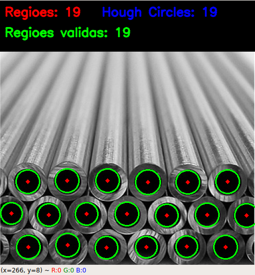
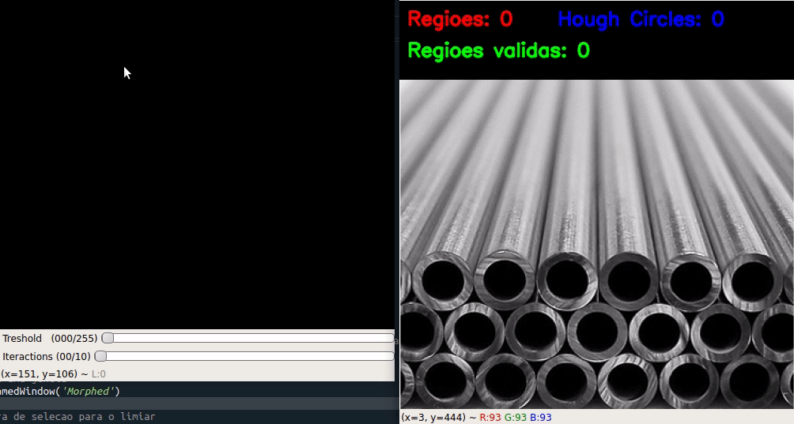
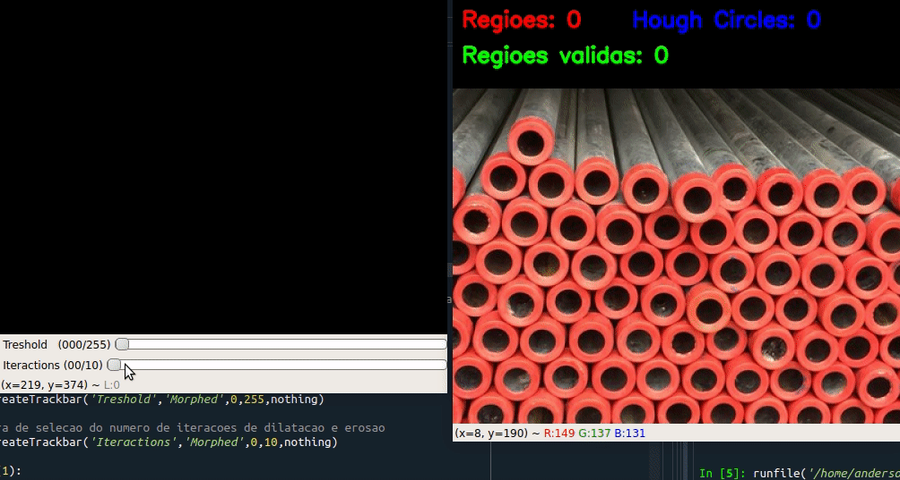

# Índice

- [Sobre](#sobre)
- [Tecnologias Utilizadas](#tecnologias-utilizadas)
- [Resultado](#resultado)
- [Como Usar](#como-usar)
- [Como Contribuir](#como-contribuir)

<h1 align="center">
    
</h1>

<!-- <a id="sobre"></a> -->

## Sobre

Este projeto tem como objetivo desenvolver uma técnica de reconhecimento de circunfêrencias mais eficiente que Hough Circles para a contagem de tubos em um estoque.

A contagem deve ser feita a partir de uma imagem frontal da amostra.

<!-- <a id="tecnologias-utilizadas"></a> -->

## Tecnologias Utilizadas

O projeto foi desenvolvido utilizando as seguintes tecnologias:

- [Python](https://www.python.org/)
- [OpenCV](https://docs.opencv.org/master/index.html)

## Resultado

<h1 align="center">
    
</h1>

Esta densidade de tubos tem bons resultados em ambas as técnicas.

<h1 align="center">
    
</h1>

Esta densidade de tubos tem melhores resultados utilizando análise por regiões.

<!-- <a id="como-usar"></a> -->

## Como usar

  É **necessário** possuir o **[Python](https://www.python.org/)** instalado na máquina.
  
```sh
  $ github.com/andersondi/metal-tubes-counter
  $ cd metal-tubes-counter
  $ pip install numpy
  $ pip install opencv-python
```

<!-- <a id="como-contribuir"></a> -->

## Como contribuir

- Faça um Fork desse repositório,
- Crie uma branch com a sua feature: `git checkout -b my-feature`
- Commit suas mudanças: `git commit -m 'feat: My new feature'`
- Push a sua branch: `git push origin my-feature`

---
Feito com :heart: por [Anderson Dias]("https://www.linkedin.com/in/aodias/")
